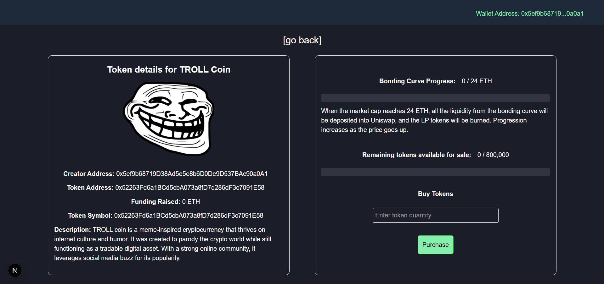

# Token Launchpad



## About the project

Token Launchpad is a decentralized application that is deployed on Sepolia Testnet where you can create a new token or memecoin and other users can participate in token presales. Once the token becomes king of the hill (either reaches a funding of 24 ETH or sells max supply of token) it enters Uniswap liquidity pool then can be traded. Some amount of token is reserved already during the creation of token for liquidity.

## Getting Started

To get a local copy up and running, please follow these simple steps.

**Prerequisites**

Here is what you need to be able to run.

- Node.js (Version: >=18.x)
- Next.js (version:>=15.2.x)
- Foundry

## Development

**Setup**

1. Clone the repo.

   ```shell
   git clone https://github.com/sanjay-in/token-launchpad.git
   ```

2. Run local anvil node

   ```shell
   anvil
   ```

3. Run deploy script in new window

   ```shell
   forge script script/DeployTokenLaunchpad.s.sol --rpc-url <anvil_local_url> --private-key <anvil_deployer_private_key> --broadcast
   ```

   > _The <anvil_local_url> and <anvil_deployer_private_key> can be found in anvil node. Use the first anvil private key for <anvil_deployer_private_key>_

**Start client**

1. Open new window
   ```shell
   cd client
   ```
2. Install dependencies
   ```shell
   npm i
   ```
3. Start development client server
   ```shell
   npm run dev
   ```
4. Create constant.js in constant folder and add

   ```shell
   export const CONTRACT_ADDRESS = <contract_address>
   export const ABI = <contract_ABI>
   ```

5. Add Cloudinary values to .env file
   ```shell
    NEXT_PUBLIC_CLOUDINARY_UPLOAD_PRESET=<preset_name>
    NEXT_PUBLIC_CLOUDINARY_CLOUD_NAME=<cloud_name>
   ```

## License

Distributed under the MIT License. See LICENSE for more information.
